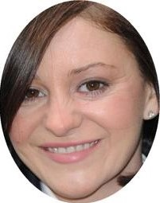
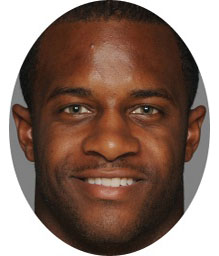

# Healthy Sleep Study

Throughout these lessons, we will be working with a data set adapted from the Healthy Sleep Study, conducted by the Sleep Behavior Lab at a large research university. In this study, researchers Garrett Jorgensen, Molly Burke, Dan Schuster, and Kaitlyn Albertoni studied how exercise may help improve sleep quality.

| Patrick Edwards           | Debra Bailey                | Paul Carter                | Carlotta Caputo             |
| ------------------------- | --------------------------- | -------------------------- | --------------------------- |
|  |  |  |  |

During this study, the research team recruited 1,200 healthy adult participants and measured their step count, distance walked, hours of sleep, and average heart rate for each day over a two-week period (Schuster et. al. 2007). The final data shows the daily step count, distance walked, and so forth for each participant, averaged over the two weeks. 

Burke, Schuster, Albertoni, and Jorgensen used the tools of data analysis to find patterns in this data. In the following lessons, we'll learn some of those same tools to come to the same conclusions about sleep and exercise presented in their final paper.

# Other names

| Shawnta Sanders             | Osbaldo Estrada            | Areli Esparza                | Toshia Nakagawa             |
| --------------------------- | -------------------------- | ---------------------------- | --------------------------- |
|  |  |  |  |

| Kevin Lemus                | Keshaun Sanders           | Neiko Nakagawa            | Osbaldo Estrada            |
| -------------------------- | ------------------------- | ------------------------- | -------------------------- |
|  |  |  |  |

| Patrick Edwards           | Don Carter                | Paul Bailey               | Carson Caputo             |
| ------------------------- | ------------------------- | ------------------------- | ------------------------- |
|  |  |  |  |

